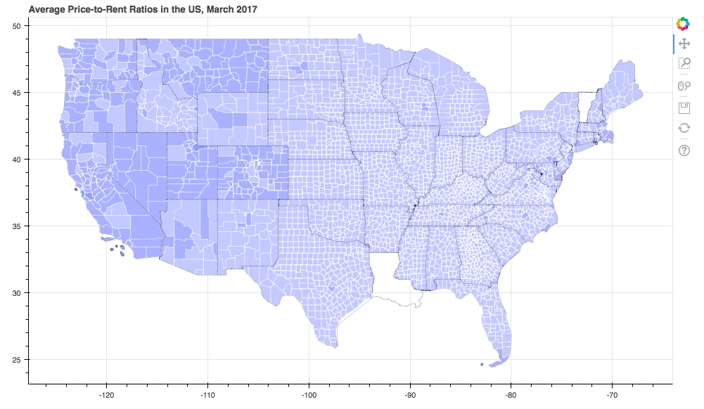
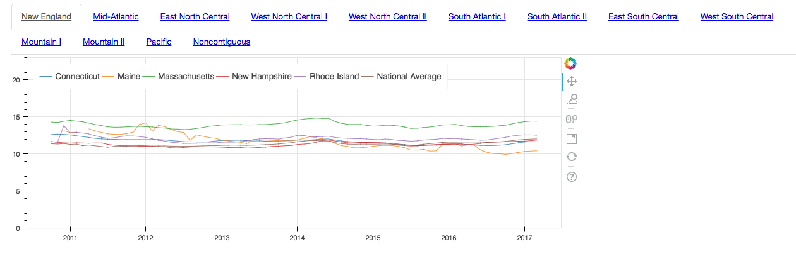

# Rental Prices
This project is the first EDA step of a larger effort to analyze where in the US it would be profitable to buy rental properties.

## Data:
Most of the data comes from Zillow which has made a wealth of home price and rental data publicly available, including the price-to-rent ratio by state and by zipcode data used here.
Source: https://www.zillow.com/research/data/

The idea was to map the price-to-rent ratios by the zipcode and plot rates by the state on a time-series.

I used Bokeh to make both plots because the library can produce some beautiful visualizations and even interactive ones. A lot of the code for my map came from the choropleth example in the Bokeh docs gallery. Since the example map used coordinates for counties instead of zipcodes, I needed to find the lats and longs corresponding to my dataset.
I was able to find zipcode coordinates here: https://gist.github.com/erichurst/7882666. However, they are interpolated points, not geometric areas, so I could not use them to fill areas on the map. What I ended up doing was aggregating zipcode rates by county and using those as values on the map.

## Results
### Map

I noticed that lot of counties in the Zillow dataset are missing ratio data, and I worked around that by plotting median state ratios in those places. Vermont and Louisiana are also completely excluded from the data. However, Zillow outlines the method they used to estimate the ratios, so that would also be something to analyze later.

### Time-series

Putting all 48 available states on one time-series plot looked really messy! To make it neat and readable, I separated the data into regions according to the divisions designated by the Census Bureau, found on Wikipedia: https://en.wikipedia.org/wiki/List_of_regions_of_the_United_States
I added the national average rates on each plot for comparison.

Github does not display files larger than 1MB, so be sure to download the actual html output and play with it on your local machine! It is really fun because Bokeh allows for interactivity, so the plots can be zoomed in and inspected closer. There are clickable tabs for each of the US regions, and lines for each state can be muted by clicking on the corresponding legend entry to make it even easier to read.

## Next Steps
Because Bokeh is so good at making interactive plots, some of the next steps to make the visualization better would be to add separate zipcode rates as points on the map and a hover tool to show them. Another tool that could be really cool to implement would be a slider that would historic data to the map and allow us to observe changes to the rates over the years.
